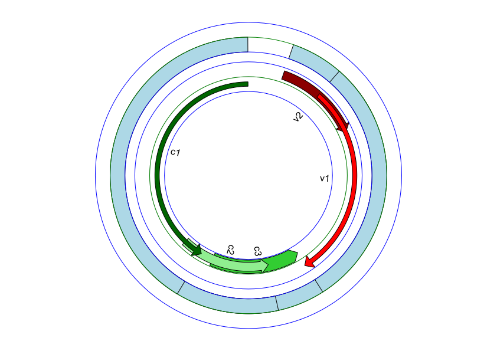

# ACM Research Coding Challenge (Spring 2021)

## No Collaboration Policy

**You may not collaborate with anyone on this challenge.** You _are_ allowed to use Internet documentation. If you _do_ use existing code (either from Github, Stack Overflow, or other sources), **please cite your sources in the README**.

## Submission Procedure

Please follow the below instructions on how to submit your answers.

1. Create a **public** fork of this repo and name it `ACM-Research-Coding-Challenge-S21`. To fork this repo, click the button on the top right and click the "Fork" button.
2. Clone the fork of the repo to your computer using `git clone [the URL of your clone]`. You may need to install Git for this (Google it).
3. Complete the Challenge based on the instructions below.
4. Submit your solution by filling out this [form](https://acmutd.typeform.com/to/uqAJNXUe).

## Question One

Genome analysis is the identification of genomic features such as gene expression or DNA sequences in an individual's genetic makeup. A genbank file (.gb) format contains information about an individual's DNA sequence. The following dataset in `Genome.gb` contains a complete genome sequence of Tomato Curly Stunt Virus. 

**With this file, create a circular genome map and output it as a JPG/PNG/JPEG format.** We're not looking for any complex maps, just be sure to highlight the features and their labels.

**You may use any programming language you feel most comfortable. We recommend Python because it is the easiest to implement. You're allowed to use any library you want to implement this**, just document which ones you used in this README file. Try to complete this as soon as possible.

Regardless if you can or cannot answer the question, provide a short explanation of how you got your solution or how you think it can be solved in your README.md file. However, we highly recommend giving the challenge a try, you just might learn something new!

## Solution and Approach

Using the BioPython library, the model above displays a **circular diagram of the Tomato Curly Stunt Virus Genome's Features**. The "gene" type Features are placed on the **two innermost levels** representing plus (red) and minus (green) strands. The coding sequence (CDS) type features, regions of the nucleotides which actually code proteins, are placed together on the **outermost layer (no strand).** The "gene" type features have been shaped using **"ARROW" sigils with varying shaft thickness** in order to allow for easy comparison of starting and ending locations of each Feature along with individual comparisons to other features since some features overlap. Next to each "gene" type Feature is the label detailing the specific gene being referenced.

Prior to this challenge, I have had no experience using Python for computational biology or anything of the sort. As a result, thinking on my feet and finding efficient ways to answer the prompt were critical for coming up with this solution. While the code specific methodology is commented in the file "GenomeMapper.py," here is a basic overview of the process used to create the model above:

**1) Understanding how data is stored in a genbank file:**

Before being able to display the data, it was important to realize what exactly I am displaying and how that data is organized in a GenBank file. In order to learn this, I visited the **NCBI database** where I was able to find **documentation** on the format of GenBank files and what data is stored inside of them.
 
From this, I was able to understand that "Features" refer to regions of biological significance such as eukaryotic genes, tRNA, etc. In this case, I was able to learn the significance of the **"gene" type and "Coding Sequence (CDS)" type** Features which would later influence the format of my diagram. In addition, learning the format of the file allowed me to later easily extract the data I needed.  

**2) Finding a library/ package**

Following a simple google search, I was able to find the **BioPython package**, specifically the **GenomeDiagram module** within it. After reading the documentation, I had a good idea of how to organize my program and how to execute actions such as extracting data from the GenBank file and displaying it. The **ReportLab** module was also installed in order to export files.

**3) Understanding how data is represented in a circular genomic diagram:**

Now that I had an understanding of how to programmatically approach the task, I needed to understand the **structure of the diagram** in order to effectively display the data. After looking at **other examples available online**, I was able to make a couple of observations on how they are generally formatted. Having seen how data is portrayed in the contextual scenario of research, I was able to make decisions on the graphic display of my diagram and what elements to include.

For example:

* Even though it **may seem natural** to separate overlapping Features by placing them on separate levels, it is important to understand that **each level signals the feature's position on either the plus or minus strand** (outermost being plus). As a result, the features are placed on two levels corresponding to their strand values.

* CDS features are generally placed **outside of the outermost non CDS Feature level** which is visible in this model

* Arrow thickness was modified for each Feature in order to make it **easier to see where a Feature starts and ends** despite intersecting Features. This also allowed for individual Feature comparison without having to encounter any issues with strand levels as mentioned earlier.

* Color was decided based on **strand level** with inter-level variance based on shades

**4) "Debugging" the model**

Since there was not "correct" answer given to us, to check the accuracy of my program, I tested my program on **another GenBank document** _(NC_005816: Yersinia pestis biovar Microtus str. 91001 plasmid pPCP1)_ and compared my results with the **publicly available model** for it which GenomeDiagram came up with before. This allowed me to fine tune any errors in my code and also gain a greater understanding fo the parameters influencing the display of the diagram.

**Potential Improvements**

The GenomeDiagram module has a lot of functionality that was not fully utilized in this case as the challenge itself was **only referring to the display of Features.** In the context of genome diagrams in general, they generally have several **recognition sequences** which indicate series of nucleotides recognizable by restriction enzymes which degrade viral DNA at these sequence locations. These can generally be plotted out as well but were not plotted in this model since these are **not "Features" per se** and are derived from the "Origin" section of a GenBank file. In addition, many genome diagrams contain a level indicating the **GC Skew**, a metric comparing the levels of guanine and cytosine- calculated by starting at location 0 and incrementing the skew by 1 for every guanine and -1 for every cytosine. By using the **GraphSet class**, this data can be plotted over all the locations as its own level but since this again is **not necessarily a "Feature,"** it was not included in this model. 

**Libraries/Modules Used:**

* BioPython - GenomeDiagram, SeqIO

* ReportLab

**Sources(Information used):**

BioPython Documentation: https://biopython.org/wiki/Documentation

GenomeDiagram Documentation: https://biopython.org/docs/1.75/api/Bio.Graphics.GenomeDiagram.html

SeqIO Documentation: https://biopython.org/docs/1.75/api/Bio.SeqIO.html

ReportLab Documentation: https://www.reportlab.com/dev/docs/

GenBank Document Structure Documentation: https://www.ncbi.nlm.nih.gov/Sitemap/samplerecord.html

Test GenBank (Yersinia Pestis): https://www.ncbi.nlm.nih.gov/nuccore/NC_005816